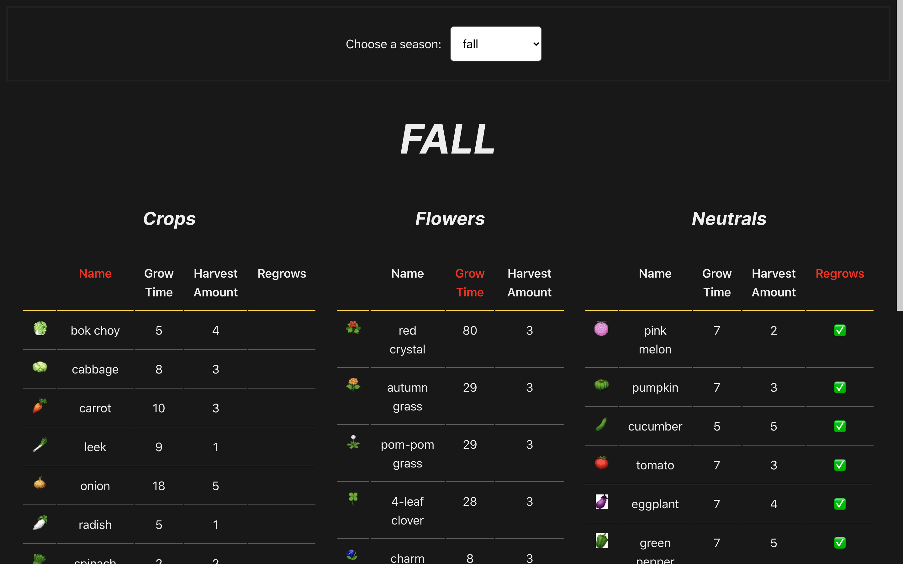

# Rune Factory 4 Crop Tracker - Client (Frontend)
This app is for viewing in-season crops and flowers in the game Rune Factory 4 Special.

Link to the Backend Repository [here](https://github.com/lsamano/rf4-crop-tracker-api).

# Setup
Run `npm install` to install dependencies and `npm start` to start the server. Server will run on Port 3001.

# Current Features
- Choose a season in the dropdown menu to view its in-season crops and flowers.
  - Neutral crops included if applicable.
- Clicking the headers of each table sorts them.
  - It will highlight light green to let you know what you are sorting by.
